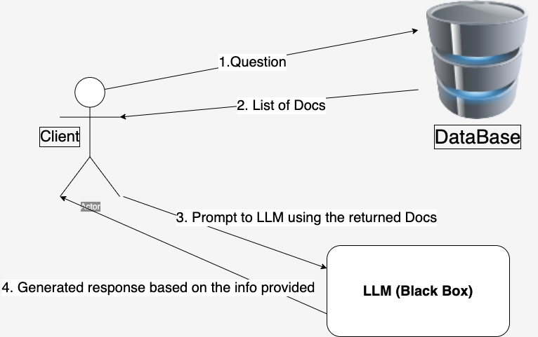

# Introduction to LLMs and RAG systems
<!-- vscode-markdown-toc -->
* 1. [Intro](#Intro)
* 2. [What is RAG?](#WhatisRAG)
* 3. [System Shape](#SystemShape)
* 4. [Environment preparation](#Environmentpreparation)
	* 4.1. [Python and pipenv installtions](#Pythonandpipenvinstalltions)
	* 4.2. [Choosing DB](#ChoosingDB)
	* 4.3. [Choosing LLM provider](#ChoosingLLMprovider)
* 5. [Establishing QA RAG System](#EstablishingQARAGSystem)
	* 5.1. [Insalling packages we need](#Insallingpackagesweneed)
	* 5.2. [Configuring environment variables needed for GROQ credentials](#ConfiguringenvironmentvariablesneededforGROQcredentials)
	* 5.3. [preparing Docs](#preparingDocs)
	* 5.4. [Start elasticsearch server](#Startelasticsearchserver)
* 6. [Loading DOCs to elasticsearch](#LoadingDOCstoelasticsearch)
* 7. [Building R - A - G](#BuildingR-A-G)
	* 7.1. [R - Retrieving the most related documennt to certain query form elasticsearch](#R-Retrievingthemostrelateddocumennttocertainqueryformelasticsearch)
	* 7.2. [Preparing the prompt](#Preparingtheprompt)
	* 7.3. [G - send the query after to the LLM and the answer will be A - Augmented by the docs content](#G-sendthequeryaftertotheLLMandtheanswerwillbeA-Augmentedbythedocscontent)

<!-- vscode-markdown-toc-config
	numbering=true
	autoSave=true
	/vscode-markdown-toc-config -->
<!-- /vscode-markdown-toc -->


##  1. <a name='Intro'></a>Intro

This module is discussing what is RAG stands for, and how build a simple RAG pipeline to answer questions.


##  2. <a name='WhatisRAG'></a>What is RAG?

RAG stands for retrival Augmented Generation. Maybe Generation is the most intuitive word, LLMs generate some content.
But think about what if I'm speialized in some specific field, so what if we let the LLM to have more specific info about the content to be generated, `strenthen` its knowledge about something, `augmenting` its knowledge base with some info `retrieved` from other `knowledge source`.

`knowledge source`: A batabase contains some documents represents our knowledge. The database can be a search engine like google from which we get info and feeding out LLM with those info.\
`retrieved`: If we asked the database/search engine a question, we get the documents related to that question. \
`augmenting`: Giving those docs to the LLM, and asking the same question we asked before to `knowledge source` and get answers tailored to those docs.


> Notice this simple RAG system, asking the question online(Database), retrieve info, feeding ChatGPT with those retieved info and then answer our question based on those info.

What if the question was more specific than that?

The answer simply says: `which course?`, we need to augment the answer with info retrived from some DB related to the specific course we asked about.

##  3. <a name='SystemShape'></a>System Shape

Building a system that can answer students' questions on a specific course.

The Goal to build a system does the following steps:
1. Ask question to DB and get relative docs.
2. Build query using those docs and send this query to a LLM.
3. Get the answer from the LLM.

```python
def qa_rag_system(query):
    search_results = elastic_search(query)
    prompt = build_prompt(query, search_results)
    answer = llm(prompt)
    return answer
```

##  4. <a name='Environmentpreparation'></a>Environment preparation

1. installing [python](https://www.python.org/downloads/)
2. installing [pipenv](https://pipenv.pypa.io/en/latest/)
  ```python
  # In project folder
  pip install pipenv
  ```
3. Choosing your DB that contains knowledge
4. Choosing LLM provider.

> [!NOTE]
> In my case, I used github codespaces which provides you with a VM containing all tools you will need. Developing RAG applications locally is costy and requires lots of hardware resources.

###  4.1. <a name='Pythonandpipenvinstalltions'></a>Python and pipenv installtions

If using github codespaces you will find python pre-installed but not pipenv. Pipenv is a Python virtualenv management tool used to separate your project dependencies from the rest of the system. In github codespaces you will really found separate environnments really useful as you are already working on a whole separate system from your computer.

###  4.2. <a name='ChoosingDB'></a>Choosing DB

What we need is a `Data Base` that stores our documents, and when asking it some question it returns the most precise documents it already stores (It's not the phase where we generating answers, it's about returning the exact docs to give to the LLM and generate answer).

The best choise for such case is to use [`elastic search`](https://www.elastic.co/docs), which is a nosql database used to make advanced search on the docs it contains. It's working like a search engine.

Or if you are can even build your own simple `elastic search`. To do so follow this [lesson](https://github.com/alexeygrigorev/build-your-own-search-engine) using TF-IDF and cosine similarity to retrieve relevant info.

###  4.3. <a name='ChoosingLLMprovider'></a>Choosing LLM provider

There's lots of LLMs. You may use OpenAI chatgpt platform. all you need is to make [`API key`](https://platform.openai.com/api-keys) and use it to communicate with your prefered openAI model. I used a free open-source LLM called `LLaMA3 8b` developed by meta provided by a plcatform called [groq](https://groq.com/). You also need to make an [`API key`](https://console.groq.com/keys) and then start communicating with the preferred model.

Many other free LLMs can be found on this [document](https://github.com/DataTalksClub/llm-zoomcamp/blob/main/01-intro/open-ai-alternatives.md).

##  5. <a name='EstablishingQARAGSystem'></a>Establishing QA RAG System

###  5.1. <a name='Insallingpackagesweneed'></a>Insalling packages we need

```shell
pip install requests groq tqdm elasticsearch titoken notebook==7.1.2

# groq is the package used to communicate with (LLaMA3 8b) model.
# tqdm is a progress bar package, used to visualize looping progress.
# elasticsearch is the package used to communicate with elsaticsearch DB.
# tiktoken is an open source package used by openAI models to calculate the number of tokens in the input and the generated output.
```

###  5.2. <a name='ConfiguringenvironmentvariablesneededforGROQcredentials'></a>Configuring environment variables needed for GROQ credentials

Adding `GROQ_API_KEY` which is used by groq package to authenticate your connection to `groq_api`.

```bash
export GROQ_API_KEY='{API_KEY}' # It's really secret and you need to hide it.
```

###  5.3. <a name='preparingDocs'></a>preparing Docs
Now you should prepare the Documents you want to store on elasticsearch and use it later as you knowledge base. So after storing those docs and then you ask elasticsearch a question, you got the most relatice documents to your ansewe.

The docs used during this module is the FAQ of Zoomcamp courses ([DE Zoomcamp](https://docs.google.com/document/d/19bnYs80DwuUimHM65UV3sylsCn2j1vziPOwzBwQrebw/edit), [ML Zoomcamp](https://docs.google.com/document/d/1LpPanc33QJJ6BSsyxVg-pWNMplal84TdZtq10naIhD8/edit), [MLOps Zoomcamp](https://docs.google.com/document/d/12TlBfhIiKtyBv8RnsoJR6F72bkPDGEvPOItJIxaEzE0/edit)).

To download those docs and converting them to `Json` format, use the following [python notebook](https://github.com/DataTalksClub/llm-zoomcamp/blob/main/01-intro/parse-faq.ipynb).

###  5.4. <a name='Startelasticsearchserver'></a>Start elasticsearch server

using Docker which is pre-installed on github code spaces, you can start an isolated elasticserch server that contains your Docs.
```bash
docker run -it \
    --rm \
    --name elasticsearch \
    -p 9200:9200 \
    -p 9300:9300 \
    -e "discovery.type=single-node" \
    -e "xpack.security.enabled=false" \
    docker.elastic.co/elasticsearch/elasticsearch:8.4.3
```

```bash
# Testing connectivity
curl http://localhost:9200
```

You should get something like this
```bash
{
  "name" : "741ed89c1f9b",
  "cluster_name" : "docker-cluster",
  "cluster_uuid" : "7YWbsBlmSP6psPlfr_s-lw",
  "version" : {
    "number" : "8.4.3",
    "build_flavor" : "default",
    "build_type" : "docker",
    "build_hash" : "42f05b9372a9a4a470db3b52817899b99a76ee73",
    "build_date" : "2022-10-04T07:17:24.662462378Z",
    "build_snapshot" : false,
    "lucene_version" : "9.3.0",
    "minimum_wire_compatibility_version" : "7.17.0",
    "minimum_index_compatibility_version" : "7.0.0"
  },
  "tagline" : "You Know, for Search"
}
```

##  6. <a name='LoadingDOCstoelasticsearch'></a>Loading DOCs to elasticsearch

1. start elasticsearch connection
```python
es_client = Elasticsearch('http://localhost:9200')
```
2. build an `index` which is `relation` in DBMS 

```python
# think about it as a relation with 4 columns and the primary key called "course" by which you group the docs.
# when searching, elastic search searches the oother 2 columns for similarity and return the most similar ones.
index_settings = {
    "settings": {
        "number_of_shards": 1,
        "number_of_replicas": 0
    },
    "mappings": {
        "properties": {
            "text": {"type": "text"},
            "section": {"type": "text"},
            "question": {"type": "text"},
            "course": {"type": "keyword"} # primary key in RDBMS taste
        }
    }
}

index_name = "course-questions"

es_client.indices.create(index=index_name, body=index_settings)
```
3. load docs to `course-questions` index
```python
for doc in tqdm(documents):
    es_client.index(index=index_name, document=doc)
```

Now all setup is done, we have the knowledge base (DB) so start RAG.

##  7. <a name='BuildingR-A-G'></a>Building R - A - G

###  7.1. <a name='R-Retrievingthemostrelateddocumennttocertainqueryformelasticsearch'></a>R - Retrieving the most related documennt to certain query form elasticsearch

```python
def filter_search(query, size=5, search_words=[]):
    def filter_builder():
        return list(map(lambda word: {"term": {**word}}, search_words))
        
    search_query = {
        "size": size, # number of docs to be returned
        "query": {
            "bool": {
                "must": {
                    "multi_match": {
                        "query": query,
                        # Giving higher score for the document if the question of the document is much similar 
                        # to the query than the text of the document.
                        "fields": ["question^4", "text"],
                        "type": "best_fields"
                    }
                },
                "filter": filter_builder() # filter by the keyword (primary key)
            }
        }
    }

    return es_client.search(index=index_name, body=search_query)
```

###  7.2. <a name='Preparingtheprompt'></a>Preparing the prompt

```python
context_template = """
Q: {question}
A: {text}
""".strip()

context = ""
for doc in returned_docs:
  context += context_template.format(question=doc["_source"]["question"], text=doc["_source"]["text"]) + "\n\n"

print(context)

prompt_template = """
You're a course teaching assistant. Answer the QUESTION based on the CONTEXT from the FAQ database.
Use only the facts from the CONTEXT when answering the QUESTION.

QUESTION: {question}

CONTEXT:
{context}
""".strip()

prompt = prompt_template.format(question=query, context=context).strip()
```

###  7.3. <a name='G-sendthequeryaftertotheLLMandtheanswerwillbeA-Augmentedbythedocscontent'></a>G - send the query after to the LLM and the answer will be A - Augmented by the docs content

```python
def ask_groq(prompt, model="mixtral-8x7b-32768"):
    client = Groq(
        api_key=os.environ.get("GROQ_API_KEY"),
    )
    
    chat_completion = client.chat.completions.create(
        messages=[
            {
                "role": "user",
                "content": prompt,
            }
        ],
        model=model,
    )

    return chat_completion.choices[0].message.content

answer = ask_groq(prompt)
```

> [!NOTE]
> I wrote this file to document what I've learnt 2 weeks ago and to make it easy to remember what you forget as fast as possible by taking a glance on your own words.