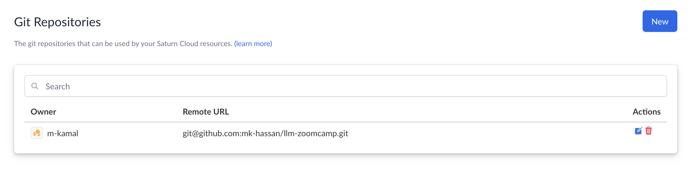

# Saturn instance setup

Thankfully, on this module we were provided with a free 15h use for and instance hosted by [Saturn Cloud](https://saturncloud.io/). This free credit allows us to run open-source LLMs fast and efficient because of the existance of a GPU.

But getting things ready wasn't straight forward, so I'm here to document what I did to setup the instance to not restart your instance lots of times like I did earlier.

1. From `Git Repositories` tab on the sidebar, add the github repo on which you want the the instance to include as a starting point to coontinue developing your app on.

> [!NOTE] Commit changes
> You still need to use git to commit your changes, and push them to github.

2. Make an account on hugging face you will it later to run LLMs that need to accept aggrements.
3. Make a secret key on hugging face and save it on .txt file to future use on the instance.

4. From `Secrets` tab on the sidebar add the following environment variables:
    - HF_TOKEN="hagging face tooken"
    - HF_HOME="path to the folder where installed LLMs will be stored"

5. From `Resources` tab on the sidebar create `New Python Server`.
6. Customize your instance, and don't forget to add the your github repo which you added previously, you should find it listed there.
7. After you click the create button, you will find your instance listed on the bottom of the resources screen, `Click on it`.
8. Before starting the instance add the enviroment variables you created previoously by clicking on `Secrets and Roles` tab.

9. Run your instance and enjoy development.