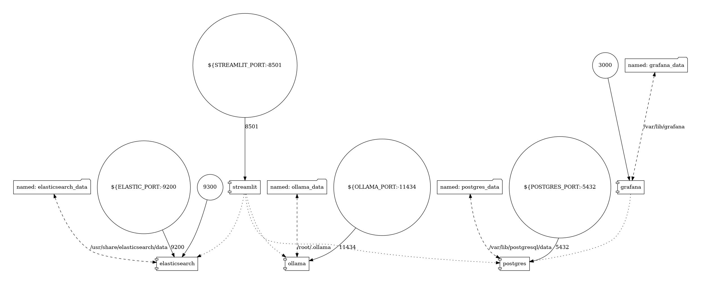

# This module System Structure

## How the system is working:

1. Intializing streamlit application.
2. User starts to ask a question.
3. The question is processed using OLLAMA container, besides the realted documents.
4. The answer from the OLLAMA running LLM is evaluated using LLM-as-a-judge approach just for refernece. This metric besides other system metrics are recorded and stored on the database.
5. Using `grafana` we can monitor the metrics stored on the database using different representational ways.